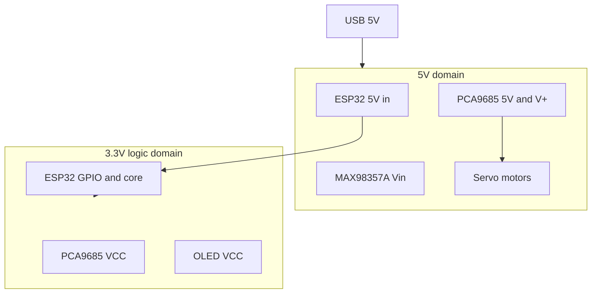

# Electricity and units

Before you touch a wire, you need a shared vocabulary. Hardware docs throw around V, A, Ω, and GND like everyone took a circuits class. You didn't — that's fine. This chapter gets you to "I know what could kill my board." Every embedded project has power rails and a common ground; Tiny Engineer is a clear example of **two voltage domains** on one USB cable.

---

## Voltage, current, resistance, power

Four quantities. You'll see them on every datasheet.

| Quantity | Unit | What it means (intuition) |
| --- | --- | --- |
| **Voltage (V)** | Volts | Electrical "pressure" — how hard electrons are being pushed |
| **Current (I)** | Amperes (amps) | Flow rate — how many electrons per second |
| **Resistance (R)** | Ohms (Ω) | How much something resists flow |
| **Power (P)** | Watts (W) | Energy used per second — P ≈ V × I |

> **If you've written backend code…** Voltage is like request pressure on a queue. Current is throughput. Resistance is backpressure. Power is your AWS bill when both spike at once.

**Ohm's law** (you don't need to derive it): V = I × R. If you push harder (more V) through the same resistance, more current flows. Thin wire = more R = less I for the same V.

---

## DC vs AC

**DC (direct current):** voltage stays one way, like a battery. Tiny Engineer runs on **5 V DC** from USB.

**AC (alternating current):** voltage flips direction — wall outlets, 50/60 Hz. Not relevant inside the robot except that your USB charger converts AC to DC before the robot ever sees it.

---

## What "ground" (GND) actually is

GND is not a magical sink into the earth. It's a **shared reference point** that every device agrees is "zero volts."

All signals are measured *relative to GND*. If two boards don't share GND, their "high" and "low" mean nothing to each other — like two services with no common schema.

**Rule:** Connect all GND pins together. One common ground net for the whole robot.

---

## Series and parallel (just enough)

**Series:** components in a chain — same current flows through all of them.

**Parallel:** components side by side — same voltage across each branch; current splits.

Your five servos are **parallel** on the 5 V rail: each gets 5 V, and current adds up. That's why five servos can pull ~1.3 A together and overwhelm a weak USB port.

---

## Shorts, reversed polarity, and smoke

Three ways beginners destroy boards. Each is a **wiring mistake**, not a firmware bug — the code may never run.

### Short circuit — power wired straight to ground

**What it is:** `+5V` and `GND` connected with **almost no resistance** between them — a bare wire, a loose strand, a metal tool, a solder bridge.

**What happens:** Current spikes (Ohm's law: low R → huge I). Wires heat. USB port or regulator shuts off — or something burns. The chip may die instantly.

**What it looks like:** Instant. Sometimes smell. Board never boots. Multimeter beep between 5V and GND *before* power-on = stop and fix wiring.

> **Software analogy:** Like routing all traffic to `/dev/null` with infinite concurrency — the system doesn't degrade gracefully; something upstream trips hard.

**Common causes while wiring:** twisted red/black leads, frayed insulation, screwdriver slip, VCC accidentally tied to GND on a breakout.

### Reversed polarity — + and − swapped

**What it is:** Power connected **backwards** — positive where ground should be, ground where positive should be.

**What happens:** Depends on the board. Some breakouts have protection diodes; many don't. Best case: nothing until you fix it. Worst case: dead regulator, dead MCU, dead module.

**Rule:** Match labels on the diagram (`5V`, `VCC`, `Vin`, `GND`). Red-ish often means positive; black/brown often means ground — **verify**, don't guess from habit alone.

> **Don't "test" reversal on purpose.** Fix orientation before first power-on.

### Logic overvoltage — 5 V on a 3.3 V GPIO pin

**What it is:** Driving **5 V into an ESP32 GPIO** that only tolerates **3.3 V**. Different from powering the whole board at 5 V through its proper **5V** input pad (that path goes through the onboard regulator).

**What happens:** Input protection may clamp once; repeated or sustained overvoltage **damages the pin or the chip**. Behavior becomes erratic; pin may die silently.

**On Tiny Engineer:** I2C, I2S, and servo **signal** lines are 3.3 V logic. Servo **motor power** is 5 V on the red wire — that goes to PCA9685 **V+**, not to an ESP32 GPIO.

> **Software analogy:** Sending a payload the parser never validated — undefined behavior, often permanent. No try/catch on the silicon.

### Quick reference

| Mistake | You literally did | Typical result |
| --- | --- | --- |
| **Short** | Connected +5V to GND directly | Huge current, heat, dead supply path or board |
| **Reversed polarity** | Swapped power + and − on a module | Dead module or MCU — may be instant |
| **Logic overvoltage** | 5 V signal into ESP32 GPIO / 3.3 V input | Damaged pin or chip — flaky then dead |

**Before first power-on:** visual check, then continuity test (power **off**) — no beep between 5V and GND; every module's GND tied together. Assembly checks: [wiring.md](../hardware/wiring.md).

---

## 3.3 V, 5 V, and ones and zeros

In code you think in **bits**: `0` and `1`, `true` and `false`, `LOW` and `HIGH`. On a GPIO pin that is **not abstract** — the chip **holds the wire at a voltage** relative to GND:

| Logic (firmware) | Typical voltage on ESP32 pin | Meaning |
| --- | --- | --- |
| **0** / `LOW` / `false` | ~**0 V** (near GND) | "Pull the line down" |
| **1** / `HIGH` / `true` | ~**3.3 V** | "Pull the line up" |

So **3.3 V is the "one" voltage** on this robot's logic wires. A **zero** is not a separate negative voltage — it's "close enough to ground."

> **If you've written backend code…** GND is 0.0; a logic **1** is ~3.3 — like a boolean with a defined numeric encoding on the wire. I2C and I2S don't send JSON; they toggle and stream voltages that the other chip interprets as bits.

### Two different jobs — don't confuse them

| | **3.3 V (logic domain)** | **5 V (power domain)** |
| --- | --- | --- |
| **Role** | Encode **0s and 1s**; run logic chips at their rated voltage | **Deliver energy** — motors, audio amp, board power input |
| **On Tiny Engineer** | ESP32 GPIO, I2C (SDA/SCL), I2S (BCLK/LRC/DIN), servo **signal** wires, **VCC** on PCA9685/OLED | Servo **motor** power (red wire → PCA9685 **V+**), MAX98357A **Vin**, ESP32 **5V** input pad |
| **Current** | Milliamps per pin / tens of mA on a **VCC** rail | Up to **~1.5 A** when servos stall |

**VCC** on a breakout (3.3 V) = "power this chip's brain so it can read and drive ones and zeros." It is **not** the same net as the 5 V that spins a servo.

**5V** on the ESP32 board = "feed the module" — an onboard **LDO** drops that to 3.3 V so the chip's core and GPIO speak the right logic levels.

### What goes wrong if you mix them up

- **5 V on a GPIO / I2C / I2S line** — you're forcing a **"one" louder than the chip allows** (~3.3 V max on ESP32). Damage. See **Logic overvoltage** above.
- **Servo motor power from 3.3 V** — the line can't supply enough **current** to move metal; brownout or dead regulator. Signal wire at 3.3 V PWM is fine; **power** wire needs 5 V.

When you read `digitalWrite(pin, HIGH)` in firmware, picture **~3.3 V on that pin**. When you read a schematic's **3V3** net, picture **the rail that defines what a "one" looks like** for every chip tied to it.

---

## Two voltage domains (the idea)

Real boards rarely run everything at one voltage. You'll see:

- A **power rail** (often 5 V) for things that need muscle — motors, amplifiers
- A **logic rail** (3.3 V) where **ones and zeros live** — GPIO, I2C, I2S, chip **VCC**

They share GND (that's your **zero**). They do **not** share the same positive rail unless a regulator explicitly converts between them.

---

## In Tiny Engineer

This robot is a textbook example of **two domains on one USB cable**.

**5 V domain** — USB comes in through the Adafruit 5993 breakout and feeds:
- ESP32 **5V** input (then an onboard LDO drops to 3.3 V for the chip)
- PCA9685 **5V** and **V+** (servo motor power)
- MAX98357A **Vin** (audio amp)

**3.3 V domain** — the ESP32's LDO generates the rail where **logic 1 = ~3.3 V** and **logic 0 = ~0 V**:
- ESP32 core and GPIO (your `HIGH` / `LOW` in code)
- PCA9685 **VCC** (chip logic + I2C — reads 0/1 on SDA/SCL)
- OLED **VCC** (display logic on the same I2C bus)

### The mistake that costs boards

The PCA9685 has **VCC** (3.3 V logic) and **V+** (5 V servo power). They must stay **separate**. Beginners jumper them because both say "power." Don't. You feed motor current into logic circuits or starve servos of voltage.

### Never power servos from 3.3 V

Five HD-1370A servos at stall draw on the order of **1.3–1.6 A**. The ESP32's LDO is rated for hundreds of mA of *logic*. Plug servos into 3.3 V and you get brownout, reset, or a dead regulator. Servos get 5 V via PCA9685 **V+**; the signal wire is 3.3 V PWM from the driver — that's fine.

### Common GND

Every module — ESP32, PCA9685, OLED, amp, servos — ties GND to the same net. Power without shared GND is like deploying microservices that can't reach each other's network.

Full stall math and symptom tables: [power.md](../hardware/power.md).

---

**Next:** [Microcontrollers and ESP32](02-microcontrollers-and-esp32.md)

**Reference:** [hardware/power.md](../hardware/power.md) · [hardware/wiring.md](../hardware/wiring.md)
