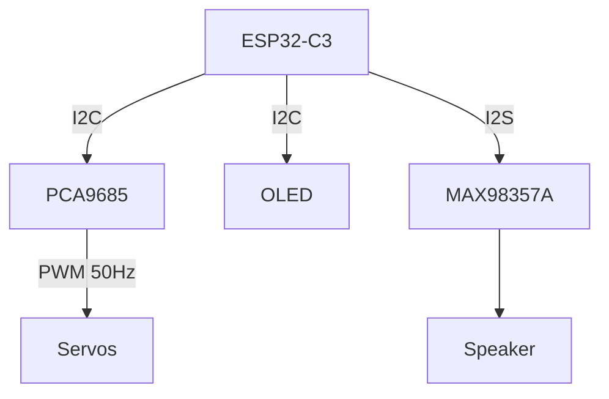

# Buses and protocols

GPIO pins output **zeros and ones** as voltages ([Ch. 02](02-microcontrollers-and-esp32.md)). A **protocol** is a schedule for those bits over time — same idea as a wire format, just on copper.

This robot uses four. **I2C and I2S look like cousins in the name. They are not.** I2C is request/response to chips with addresses. I2S is a one-way audio stream. Mix them up and nothing talks.

| Protocol | Pattern | On this robot |
| --- | --- | --- |
| **I2C** | Request/response, addressed devices | PCA9685 + OLED |
| **I2S** | Continuous audio stream | MAX98357A amp |
| **PWM (servo)** | Timed HIGH pulse = angle | PCA9685 → servos |
| **USB** | Power + serial data | Flash, monitor, 5 V in |

Pin numbers and timing: [interfaces.md](../hardware/interfaces.md).

---

## I2C — REST on two wires

**I2C** uses two shared wires:

- **SDA** — data
- **SCL** — clock (who talks when)

Many chips hang on the **same** two wires. Each has an **address** (a device ID). The ESP32 is the only **master**: "hey `0x40`, write these bytes." One chip answers.

Idle, both wires sit **HIGH** (logic 1). Devices talk by pulling a line **LOW**. The PCA9685 and OLED boards already include the resistors that hold idle HIGH — you don't add extra ones here.

> **If you've written backend code…** I2C is a shared message bus with explicit IDs. One master. Like REST: you address a host, send a payload, wait for an ACK. No answer ≈ 404 — often a swapped wire or a dead rail, not a bug in your JSON.

**On this robot:** GPIO0 = SDA, GPIO1 = SCL.

| Device | Address | If missing |
| --- | --- | --- |
| PCA9685 (servo driver) | `0x40` | **Fatal** — red RGB, firmware hangs |
| SSD1306 OLED | `0x3C` | **Soft fail** — robot works, no display |

PCA9685 is load-bearing. OLED is nice-to-have for bring-up.

**Traps:**
- SDA/SCL swapped → nothing works
- OLED pad labeled **SCK** is I2C **SCL**, not SPI clock
- "Device not found" *after* servos start moving → often **power sag**, not a bad bus. See [Ch. 07](07-power-budgets-and-safety.md)

---

## I2S — a streaming socket for sound

**I2S** (Inter-IC Sound) pushes **audio samples** continuously. Not "read register, get byte" like I2C.

Three lines from ESP32 to the amp:

- **BCLK** — bit clock (how fast bits move)
- **LRC** (also called WS) — which sample slot this is (left/right)
- **DIN** — the actual bits

ESP32 is master: it generates clocks and **pushes**. The MAX98357A receives and drives the speaker. You don't query the amp for the next sample.

> **If you've written backend code…** I2C is REST. I2S is a one-way socket pumping PCM. While audio plays, samples go out at 44100 Hz until you stop.

Firmware here: **44100 Hz**, 16-bit. Amp is mono; firmware writes the same sample to both stereo slots. Extra amp pins (GAIN, SD) are unwired — the breakout's defaults apply.

**Trap:** speaker connects **SPK+** to **SPK−** only. **SPK− is not GND.** Tying it to ground can damage the amp. #1 audio wiring mistake.

More: [interfaces.md](../hardware/interfaces.md) · [components.md](../hardware/components.md).

---

## PWM — how long HIGH lasts is the angle

**PWM** (Pulse Width Modulation) means: pin goes **HIGH** (1), then **LOW** (0), over and over.

Hobby **position servos** don't care about "what percent of the time it's on." They measure **how long the HIGH pulse lasts** each cycle.

They expect about **50 repeats per second** (a 20 ms window). Inside that window, a HIGH of roughly **1–2 ms** sets the angle. Neutral is typically ~1.5 ms. The servo measures **time**, not voltage.

Firmware maps 0–180° to **800–2200 µs** ([servos.md](../hardware/servos.md)). Mechanical safe ranges are tighter — [robot-movement.md](../robot-movement.md).

**Why a PCA9685:** Wi-Fi + I2S + five servos on one chip makes timing jitter. The PCA9685 is a **PWM worker**: ESP32 sends an angle over I2C; the chip keeps emitting a clean 50 Hz pulse.

**Three wires per servo:**
- **SIG** — PWM (3.3 V zeros and ones from the PCA9685)
- **+5 V** — motor power from PCA9685 **V+** (not ESP32 3.3 V)
- **GND** — common ground

Joints and horns: [Ch. 05](05-servos-and-mechanical-motion.md).

---

## USB — one cable, two jobs

USB-C (Adafruit 5993 breakout) does:

- **5 V power** — feeds the whole robot
- **D+ / D−** — native USB to the ESP32 for flash and serial (`stdout`)

Not USB-PD conversion: it does **not** turn 9/12/20 V into 5 V. Feed a normal 5 V USB supply. Current limit: [Ch. 07](07-power-budgets-and-safety.md).

---

## Recap

| | Pattern | This robot | Typical mistake |
| --- | --- | --- | --- |
| **I2C** | Request/response + addresses | PCA9685 + OLED (GP0, GP1) | Swapped SDA/SCL; OLED SCK ≠ SPI |
| **I2S** | Continuous PCM stream | Amp (GP2–GP4) | SPK− tied to GND |
| **PWM** | HIGH pulse length = angle | PCA9685 → five servos | Powering servos from 3.3 V |
| **USB** | Power + serial | 5993 → 5 V + flash | Charge-only cable; expecting PD |

You'll never route I2S to the OLED. Similar names, different jobs.

---

**Next:** [Servos and mechanical motion](05-servos-and-mechanical-motion.md)

**Reference:** [hardware/interfaces.md](../hardware/interfaces.md) · [hardware/servos.md](../hardware/servos.md) · [api.md](../api.md)
