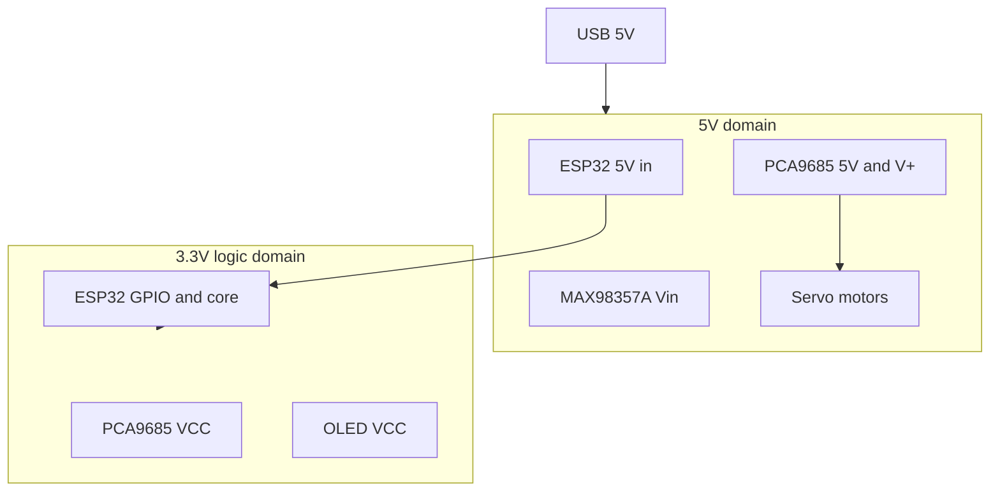

# Power budgets and safety

Software crashes give you a stack trace. Power problems give you "it worked until I ran an animation" and random reboots. This chapter is capacity planning for electrons — any design that pairs a microcontroller with motors or audio will hit the same wall. Tiny Engineer's five servos make the math honest.

---

## Why the supply rating matters

A USB charger label says **5 V / 2 A**. That's a promise of voltage and *maximum* current the source can sustain.

Every load draws what it needs (not what the label says). **Current adds in parallel:**

- ESP32 + Wi-Fi TX — tens to hundreds of mA peaks
- OLED + PCA9685 logic — tens of mA
- MAX98357A + speaker — peaks on loud WAV
- **Five servos** — **~1.3–1.6 A** if several stall together (HD-1370A datasheet)

A **1 A phone charger** is not enough. Recommendation: **5 V / ≥ 2 A**, with margin if servos move during audio.

---

## Stall current — worst-case load test

A **stall** is when the motor tries to move but can't — horn against stop, binding linkage, desk collision.

Per HD-1370A datasheet (approximate):

| Condition | Per servo | × 5 servos |
| --- | --- | --- |
| Stall @ ~4.8 V | ~260 mA | **~1.3 A** |
| Stall @ ~6.0 V | ~320 mA | **~1.6 A** |

Robot rail is ~5 V — expect something in between if multiple servos stall at once.

That's **before** Wi-Fi, display, and audio peaks.

> **If you've written backend code…** Stall current is your load test at 100× traffic. The supply must survive it or the whole service restarts (brownout).

---

## Tiny Engineer power budget story

Walk through a bad scenario:

1. Robot on a **1.5 A** USB port (5993 breakout advertises up to ~1.5 A via CC resistors — actual delivery depends on the charger)
2. Animation commands three servos at once
3. Wi-Fi transmits HTTP response
4. WAV plays through MAX98357A
5. Rail sags below ESP32 brownout threshold
6. **Reset** — looks like firmware bug; serial shows boot loop

**Symptom map:**

| Symptom | Often actually |
| --- | --- |
| Reset when servos start | Insufficient 5 V current |
| Servo jitter / weak torque | Sagging rail or thin power wires |
| OLED blank / glitch during motion | Power or I2C glitch from sag |
| I2C NACK after motion | Brownout side effect, not bad address |
| Audio crackle on loud sounds | Rail dip under combined load |

Full numbers and architecture: [power.md](../hardware/power.md).

---

## VCC vs V+ (again, because it burns boards)

On PCA9685:

| Pin | Voltage | Powers |
| --- | --- | --- |
| **VCC** | 3.3 V | Chip logic, I2C |
| **V+** | 5 V | Servo motor rail |

Jumpering them = wrong domain crossover. See [Ch. 01](01-electricity-and-units.md).

**Never** power servos from ESP32 **3V3** — LDO is for logic, not ~1.5 A of motors.

---

## USB-C breakout (5993) — what it does and doesn't do

**Does:**
- Bring USB-C connector to your wiring
- Pass **5 V** and **GND**
- Route **D+ / D−** to ESP32 for flash/serial
- Advertise ~1.5 A sink via CC resistors

**Does not:**
- Convert USB-PD 9/12/20 V down to 5 V
- Create current — only passes what the upstream charger provides

Weak laptop port or thin cable → voltage drop → mystery failures. Use a known-good **2 A** brick and a **data-capable** cable.

---

## Voltage drop on wires

Thin/long power wires have resistance. At 1.5 A, even small R means measurable voltage lost *before* the load.

**Mitigation:** shorter, thicker runs for 5 V servo power; star GND at USB breakout; don't daisy-chain power through a single Dupont jumper for all servos.

---

## Brownout

**Brownout** — supply voltage drops below what the MCU needs. ESP32 resets or behaves erratically. No graceful shutdown.

Feels like:
- Random reboot mid-animation
- "It works on USB from laptop but not from power bank"
- Worse when battery-powered USB packs sag

Fix the supply, not the code (usually).

---

## First power-up mindset

Before applying power:

1. **Visual inspect** — no obvious shorts, VCC/V+ not jumpered wrong
2. **Continuity** — multimeter beep: GND common across modules (power off!)
3. **Resistance** — no dead short between 5 V and GND (power off!)
4. **Strong supply** — bench 5 V / 2 A preferred over unknown port
5. **Servos unloaded** — horns free to move, not wedged against stops
6. **One subsystem at a time** if debugging — see [Ch. 08](08-tools-debugging-and-embedded-workflow.md)

Assembly checks: [wiring.md](../hardware/wiring.md).

---

## ESD and handling

Static discharge can kill sensitive chips. Touch grounded metal before handling ESP32. Don't slide modules on carpet. For a hobby desk build, basic awareness beats paranoia — but don't treat the C3-Zero like a rug skateboard.

---

## In Tiny Engineer — domain diagram

Bench bring-up with strong 5 V **before** cramming everything into the printed chest. Debugging power inside a closed shell is dark work.

---

**Next:** [Tools, debugging, and embedded workflow](08-tools-debugging-and-embedded-workflow.md)

**Reference:** [hardware/power.md](../hardware/power.md) · [hardware/wiring.md](../hardware/wiring.md)
