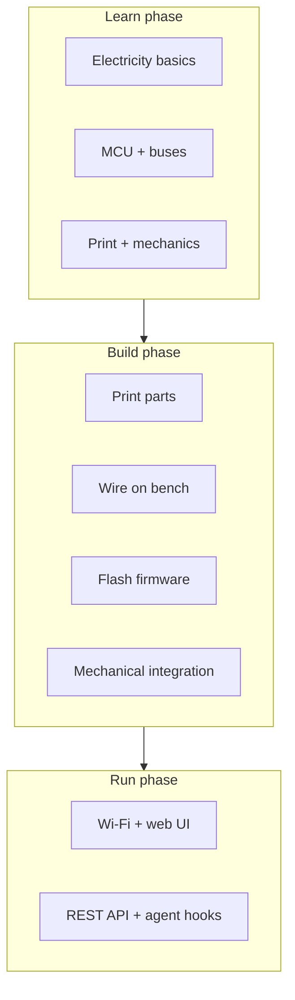
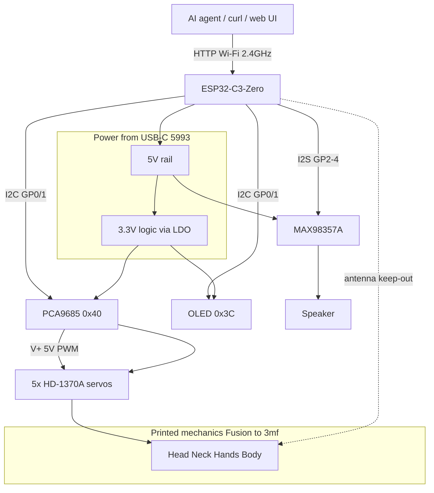

# How it all fits together

You've read the pieces. This chapter closes the loop on the guide's goal — **from software-only to hardware-capable** — then hands you to the build checklist. Tiny Engineer is the capstone: one system where electricity, firmware, buses, print, and motion connect. The vocabulary you picked up travels with you to the next board.

**Expect medium difficulty overall** — not an entry-level blinky kit, but a fair first hardware build for a software engineer who read the guide and benches before sealing the shell. Hardest areas for most SWEs: wiring density, servo mechanics, power under load. Easiest: REST and Wi-Fi once the bench work is solid.

---

## Three phases

**Learn** — this guide. Enough to not fry boards.

**Build** — [getting-started.md](../getting-started.md). Parts, print, wire, flash.

**Run** — Wi-Fi, `/anim`, Cursor hooks or your own integration.

You can overlap phases (print while reading, wire before all parts arrive). Don't skip **bench validation** before sealing the shell.

---

## The whole robot — one diagram

**Control plane:** Wi-Fi HTTP from your LAN.

**Data paths:** I2C for servos (via PCA9685) and display; I2S for audio.

**Power plane:** One 5 V in; 3.3 V logic derived; servos on 5 V motor rail.

**Mechanical plane:** Fusion CAD → printed parts → servos → pose.

---

## Subsystem → chapter map

| Subsystem | Learn in | Operate with |
| --- | --- | --- |
| Volts, amps, GND, two domains | Ch. 01, 07 | [power.md](../hardware/power.md) |
| ESP32-C3, GPIO, USB, antenna | Ch. 02 | [pinout.md](../hardware/pinout.md) |
| Wires, schematic reading | Ch. 03 | [wiring.md](../hardware/wiring.md), [diagram](../wiring/Tiny%20Engineer.drawio.png) |
| I2C, I2S, PWM | Ch. 04 | [interfaces.md](../hardware/interfaces.md) |
| Servos, horns, joints | Ch. 05 | [robot-movement.md](../robot-movement.md), [servos.md](../hardware/servos.md) |
| Print, PLA/PETG, Fusion | Ch. 06 | [3d_models/README.md](../../3d_models/README.md) |
| Supply sizing, brownout | Ch. 07 | [power.md](../hardware/power.md) |
| pio, serial, bisect debug | Ch. 08 | [testing.md](../hardware/testing.md) |
| HTTP API, agents | — (after hardware) | [api.md](../api.md), [integration.md](../integration.md), [hooks.md](../hooks.md) |

---

## Recommended build strategy (software brain edition)

### Phase A — Bench electronics (no shell)

1. Gather parts ([components.md](../hardware/components.md))
2. Wire on desk per [wiring.md](../hardware/wiring.md)
3. Flash firmware ([getting-started § Flash](../getting-started.md#4-flash))
4. Serial: PCA9685 OK
5. One servo moves via `/test/servo`
6. Wi-Fi setup, `/health`, web UI tests

**Why first:** when something fails, you can see wires and probe pins. A robot sealed in plastic is a black box.

### Phase B — Print and fit (parallel with A if possible)

1. Print structural parts ([3d_models](../../3d_models/README.md))
2. Test-fit servos in pockets — don't force
3. Adjust CAD if needed ([Fusion source](../../cad/TinyEngineer.f3d))

### Phase C — Mechanical integration

1. Mount servos with horns at center
2. Screw linkages, verify safe ranges ([robot-movement.md](../robot-movement.md))
3. Route wires, antenna clearance
4. Close shell — USB still reachable

### Phase D — Agent integration

Robot on Wi-Fi, animations work → [hooks.md](../hooks.md) or [integration.md](../integration.md).

**Temptation to avoid:** printing everything beautifully before verifying electronics. Pretty plastic won't fix a swapped SDA/SCL.

---

## Confidence milestones

Check these off — order matters:

| # | Milestone | How you know |
| --- | --- | --- |
| 1 | **Continuity sanity** | No short 5V–GND; GND common (meter, power off) |
| 2 | **Serial boot** | `pio device monitor` shows boot log, dim green LED |
| 3 | **PCA9685 detected** | Serial OK; missing = red LED hang |
| 4 | **One servo** | `/test/servo?index=0` moves head channel |
| 5 | **All five** | Each joint in safe range, no stall buzz |
| 6 | **Audio** | Sound on animation; if silent → `uploadfs` |
| 7 | **Wi-Fi stable** | `/health` over `tiny-engineer.local` or OLED IP |
| 8 | **Full anim** | e.g. `ring` — motion + sound, no reset |
| 9 | **In shell** | Same as 8 after mechanical assembly |
| 10 | **Agent** | Cursor hook or script triggers `/anim` |

Stuck on a milestone? Back one step, read [Ch. 08](08-tools-debugging-and-embedded-workflow.md) and [testing.md](../hardware/testing.md).

---

## What I'd tell any software engineer starting hardware

Not specific to day one on Tiny Engineer — things that stayed true across projects:

1. **Two voltages, one GND** — not optional mental model
2. **PCA9685 isn't optional** — plan I2C before servos
3. **Power is a feature** — 2 A supply saves hours of "random reboot" debugging
4. **Horns are calibration** — software clamps can't fix physical collision
5. **Bench before shell** — every time
6. **The docs split on purpose** — this guide for *why*, getting-started for *do*, hardware/ for *lookup*

The meta-lesson: hardware rewards the same curiosity that got you into software, but feedback is louder — smoke, buzz, heat. That's part of the fun.

---

## Handoff — go build

You're done with concepts when the milestones make sense and you know which doc to open for pin numbers.

**Operational checklist:** [getting-started.md](../getting-started.md)

**Parts → print → wire → flash → Wi-Fi → prove it → hooks.**

If you're mostly a software person: good. The bar isn't an EE degree — it's curiosity and willingness to probe a wire. In a world where AI spits out code in seconds, there's a particular joy in something on your desk that moves because *you* closed the loop from schematic to screw. Tiny Engineer is a fun capstone — but the bridge you built here works for the next project too.

---

**Next:** none — start building, or re-read any chapter from the [README](README.md).

**Reference:** [getting-started.md](../getting-started.md) · [hardware/README.md](../hardware/README.md) · [README.md](README.md)
