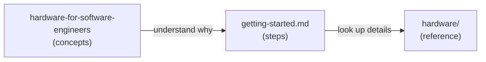

# From Code to Circuits: Hardware for Software Engineers

*Learn electronics and physical builds through Tiny Engineer — a desk robot that's fun to finish and honest about real hardware.*

I wrote this because software engineers keep asking how to build Tiny Engineer when they've never touched the hardware side — what's a servo driver, why two voltages, whether they'll destroy the board on first power-on. The build docs tell you *what to connect*; this guide answers the questions behind them.

---

## Goal

**Bring the world of electronics and hardware closer to software engineers** — especially the ones showing up with Tiny Engineer parts and no hardware background.

If you live in code, hardware docs can feel like a foreign API with no types and no stack traces. This guide closes that gap: same systems thinking you already use — buses, power budgets, failure modes — applied to volts, GPIO, and printed plastic. It's the long-form version of answers I give when someone says *"I'm a developer, I just want the robot to work."*

**Why now:** AI makes writing code fast and cheap. Hardware stays tangible, constrained, and extremely satisfying when something on your desk actually moves because *you* wired it.

**Why Tiny Engineer as the example:** one coherent stack (MCU, I2C, I2S, power domains, 3D print, servos) — real enough to teach honest hardware, bounded enough to finish if you stick with it. It also ties back to software via Wi-Fi and HTTP, which helps the mental bridge.

**What you'll get out of it:** read datasheets, schematics, and embedded docs without feeling like an outsider — whether you build this robot or the next board on your bench.

**Honest expectation:** Tiny Engineer was never meant to be an entry-level electronics kit (no single-LED breadboard tutorial). Overall difficulty is **medium**. It can still be your **first hardware project** as a software engineer — if you read first, bench-test before closing the shell, and don't treat "first" as "trivial." See [difficulty by area](#honest-difficulty-by-area) below.

---

I'm a software engineer. I got into hardware and electronics long before Tiny Engineer — out of curiosity, because I find it fun, and because making something *physical* work hits different from shipping another service. I'm not an EE. I've smelled the regret breadboard too; I've also had plenty of projects since then that actually moved and blinked.

Tiny Engineer is one project in that line. I'd recommend this path to any software engineer: learn the basics, wire something on a bench, watch it do a thing you commanded. Especially now, when a servo buzzes because you misaligned a horn — not because a model hallucinated a pin number — you learn something no codegen session replaces.

**What this is:** a bridge into electronics, microcontrollers, power, protocols, and mechanical build craft — taught with software-engineer mental models.

**What this is not:** only a Tiny Engineer assembly manual. When you're ready to wire and flash step by step, use [getting-started.md](../getting-started.md) and the [hardware reference](../hardware/README.md).

---

## Why Tiny Engineer is the example

Every chapter teaches a **general concept**, then shows **where it lands in this build**. Tiny Engineer gives you real constraints — 3.3 V vs 5 V domains, shared I2C, offloaded servo PWM, print tolerances, antenna keep-out — without throwing you into a parts warehouse with no narrative. Finish the robot if you want the payoff; the vocabulary transfers to other ESP32, Arduino, or IoT projects either way.

It's a good **first hardware project for a software engineer**. It is **not** a good **first project in electronics** in the abstract — compare it to a blinking-LED kit and this is several notches up. This guide exists because those two truths collide constantly in questions from SWEs who want to build the robot anyway.

---

## Honest difficulty by area

Rough levels: **Easy** · **Medium** · **Medium–High** (for someone with no prior hardware builds). Overall build: **Medium**.

| Area | Level | Why |
| --- | --- | --- |
| [Electricity & power domains](01-electricity-and-units.md) | Medium | Two voltage rails, common GND, VCC vs V+ — mistakes fry boards, not just fail tests |
| [Microcontrollers & ESP32](02-microcontrollers-and-esp32.md) | Medium | Wi-Fi MCU, native USB, scarce GPIO, flash/LittleFS — more moving parts than Arduino Uno 101 |
| [Wiring & schematics](03-wiring-craft-and-schematics.md) | Medium–High | Six-ish modules, many nets, classic traps (swapped I2C, speaker on GND) |
| [Buses: I2C, I2S, PWM](04-buses-and-protocols.md) | Medium | Three protocol types in one device; standard hobby stack, but not "one wire one LED" |
| [Servos & mechanical motion](05-servos-and-mechanical-motion.md) | Medium–High | Five joints, horn alignment, mechanical limits, binding/stall — software clamps can't fix physics |
| [3D printing & mechanical build](06-3d-printing-and-mechanical-build.md) | Medium | Many printed parts, tolerances, partial assembly docs; optional Fusion edits add learning curve |
| [Power budgets & safety](07-power-budgets-and-safety.md) | Medium | Real stall currents (~1.3–1.6 A), supply sizing, brownout debugging |
| [Embedded workflow & debug](08-tools-debugging-and-embedded-workflow.md) | Medium *(lower if you live in CLI)* | PlatformIO, serial, bisect bring-up — familiar shape for SWEs, unfamiliar failure modes |
| REST / Wi-Fi / agent hooks | Easy *(for SWEs)* | HTTP you already know — **after** hardware works |

**What makes it medium, not beginner-kit:**
- Multiple ICs on shared buses, not one chip
- Motor power + logic power discipline
- Mechanical assembly with real tolerances
- Debug requires dividing hardware vs software

**What makes it viable as a first SWE hardware project:**
- Documented BOM, wiring, firmware — not a blank breadboard
- Software-shaped affordances: serial logs, HTTP `/test/*`, web UI
- This guide translates concepts into your vocabulary first
- Finish line is motivating (desk robot, not only a blinking LED)

If you've never touched a multimeter, budget extra time on [Ch. 01](01-electricity-and-units.md), [Ch. 07](07-power-budgets-and-safety.md), and bench bring-up in [Ch. 08](08-tools-debugging-and-embedded-workflow.md). Skipping straight to "assemble everything and flash" is how medium projects feel hard.

---

## Who should read this

**Read this if you:**
- Write code for a living and want to build Tiny Engineer (or similar) without a hardware background
- Got the parts or the repo and hit questions the assembly docs don't pause to explain
- Know what HTTP is but not what I2C is
- Can follow a tutorial but want to understand what you're doing
- Are curious about embedded, IoT, or physical computing — even if you've never soldered

**Skip this if you:**
- Already own a multimeter and use words like "pull-up" without Googling
- Have built an ESP32 project before and just need the BOM — go to [getting-started.md](../getting-started.md)

**Don't skip the difficulty section** if this is your first hardware build — [Honest difficulty by area](#honest-difficulty-by-area) sets expectations.

---

## How this fits the rest of the docs

There are three layers. Read them in order when you're learning; jump to the right layer when you know what you need.

| Layer | When to use it |
| --- | --- |
| **This guide** | Bridging hardware/electronics concepts from a software background |
| **[getting-started.md](../getting-started.md)** | Doing the build step by step |
| **[hardware/](../hardware/README.md)** | Looking up pins, wiring, power numbers, test procedures |

---

## Reading order

**Full path** (recommended if hardware is new to you):

1. [Electricity and units](01-electricity-and-units.md)
2. [Microcontrollers and ESP32](02-microcontrollers-and-esp32.md)
3. [Wiring craft and schematics](03-wiring-craft-and-schematics.md)
4. [Buses and protocols](04-buses-and-protocols.md)
5. [Servos and mechanical motion](05-servos-and-mechanical-motion.md)
6. [3D printing and mechanical build](06-3d-printing-and-mechanical-build.md)
7. [Power budgets and safety](07-power-budgets-and-safety.md)
8. [Tools, debugging, and embedded workflow](08-tools-debugging-and-embedded-workflow.md)
9. [How it all fits together](09-how-it-all-fits-together.md)

**Shortcuts** — where universal concepts land in this build; jump to one chapter if you only need that topic:

| You need to understand… | Read |
| --- | --- |
| ESP32-C3-Zero, GPIO, USB, antenna | [Ch. 02](02-microcontrollers-and-esp32.md) |
| 3.3 V vs 5 V, LDO, VCC vs V+ | [Ch. 01](01-electricity-and-units.md) + [Ch. 07](07-power-budgets-and-safety.md) |
| I2C (OLED + PCA9685) | [Ch. 04](04-buses-and-protocols.md) |
| I2S (audio) | [Ch. 04](04-buses-and-protocols.md) |
| Servo PWM chain | [Ch. 04](04-buses-and-protocols.md) + [Ch. 05](05-servos-and-mechanical-motion.md) |
| Fusion CAD edits | [Ch. 06](06-3d-printing-and-mechanical-build.md) |
| PLA vs PETG | [Ch. 06](06-3d-printing-and-mechanical-build.md) |

---

## Mini glossary

Terms you'll see everywhere. Each chapter goes deeper. Think of these as hardware concepts translated into software-shaped words.

| Term | One-line meaning |
| --- | --- |
| **MCU** | The chip that runs your firmware — like a tiny server that boots straight into one binary (no OS, no SSH). Here: ESP32-C3 |
| **GPIO** | A pin the firmware can drive or read — hardware I/O endpoints, not USB or Wi-Fi |
| **GND** | Shared **0 V reference** for every module — like agreeing on one clock/time base; without it, nothing can talk reliably |
| **3.3 V / 5 V** | **Signal voltage** (3.3 V, ESP32-safe) vs **power rail** (5 V, servos/amp) — two different numbers; don't mix them up |
| **LDO** | Onboard **5 V → 3.3 V converter** for logic chips — sized for milliamps, not motors |
| **I2C** | Two-wire **request/response bus** — each chip has an address (`0x40`, `0x3C`); ESP32 is the only master |
| **I2S** | **Streaming audio bus** — continuous PCM samples over wires, like a one-way socket, not I2C-style reads |
| **PWM** | A pin toggling on/off on a schedule — servos read **pulse length** inside each cycle as "go to this angle" |
| **Brownout** | Power sags → chip **hard-resets** — feels like a random reboot, often when servos or audio spike current |
| **PCA9685** | **Servo PWM co-processor** — ESP32 sends angles over I2C; this chip generates the precise 50 Hz pulses |

---

## When you're ready to build

You've read enough when you can explain in plain language:

- Why servos don't get power from the ESP32's 3.3 V pin
- What I2C and I2S do on this robot (and that they're different)
- Why there's a separate PCA9685 chip instead of "just PWM in code"
- Where the ceramic antenna is and why you shouldn't bury it in plastic

Then open [getting-started.md](../getting-started.md) and work through parts → print → wire → flash → Wi-Fi → prove it.

**Reference:** [getting-started.md](../getting-started.md) · [hardware/README.md](../hardware/README.md) · [3d_models/README.md](../../3d_models/README.md)
